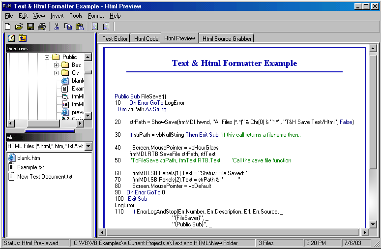



## Text & Html Formatter v 1\.3\.0

### Description

This Will Format Your Code/Text/Article/Tutorial Into HTML Format and save you heaps of time submitting your ideas trying to convert text or even CODE into HTML Friendly Format. New: MDIForm, Html Stripper, Resize functions, Treeview for Dir's, Listview for folder contents, Reworked Format Functions. Previous: Martin K. sent me a 'Tweaked' copy of v1.0.0 and I have continued work from there. Also added Color coded RTB, Frame Wrap, Insert Menu, Print option, Resize Text and WebBrowser windows (not form) with form drag! Added VB.frm Filter to remove 'rubbish' from file while loading code. Credits for source code to: Martin K, Will Barden, Mr Bobo, Sherif Rofael, Roger Gilchrist, La Volpe, Anyone I missed! Thankyou to all who submit to P.S.C. Please comment and vote!

Open the project, click 'Help', click 'Example' for a demonstration.
 
### More Info
 

             |
---                |---
**Submitted On**   |2003-07-06 18:37:54
**By**             |[Dream](https://github.com/Planet-Source-Code/PSCIndex/blob/master/ByAuthor/dream.md)
**Level**          |Intermediate
**User Rating**    |4.2 (21 globes from 5 users)
**Compatibility**  |VB 6\.0
**Category**       |[Internet/ HTML](https://github.com/Planet-Source-Code/PSCIndex/blob/master/ByCategory/internet-html__1-34.md)
**World**          |[Visual Basic](https://github.com/Planet-Source-Code/PSCIndex/blob/master/ByWorld/visual-basic.md)
**Archive File**   |[Text\_&\_Htm161052762003\.zip](https://github.com/Planet-Source-Code/dream-text-html-formatter-v-1-3-0__1-46681/archive/master.zip)

